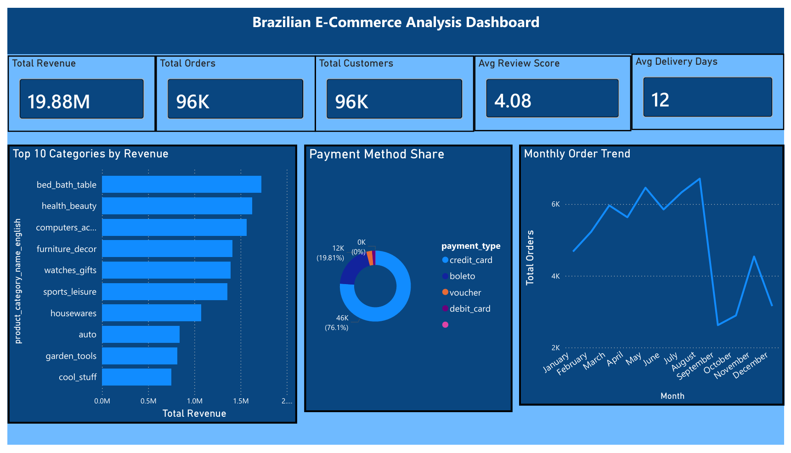
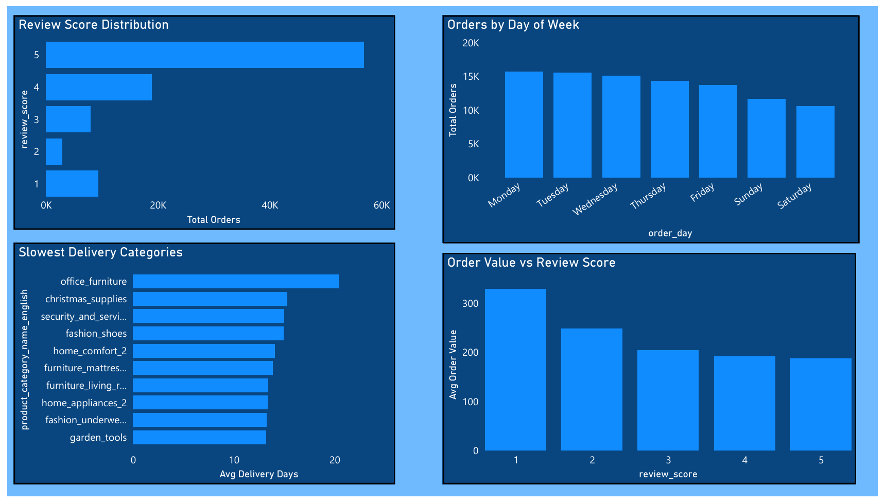
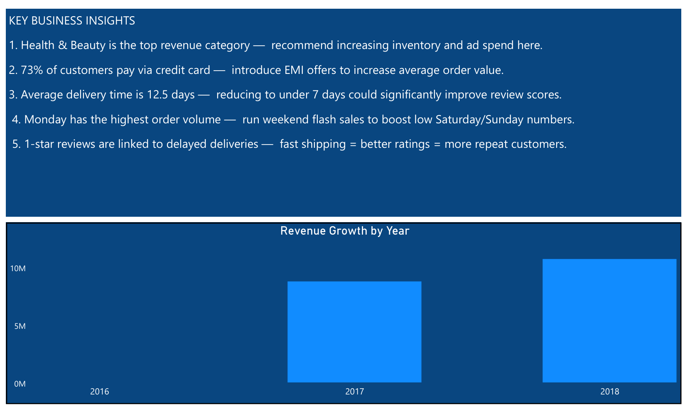
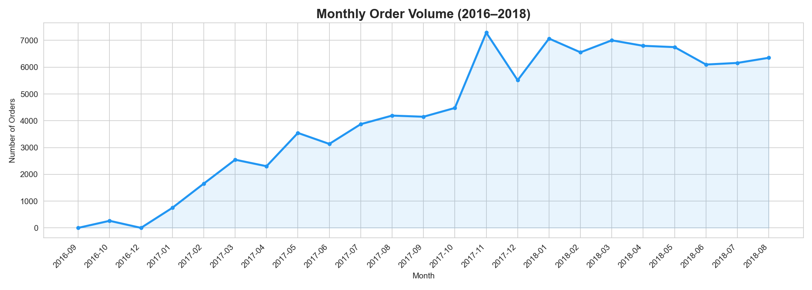
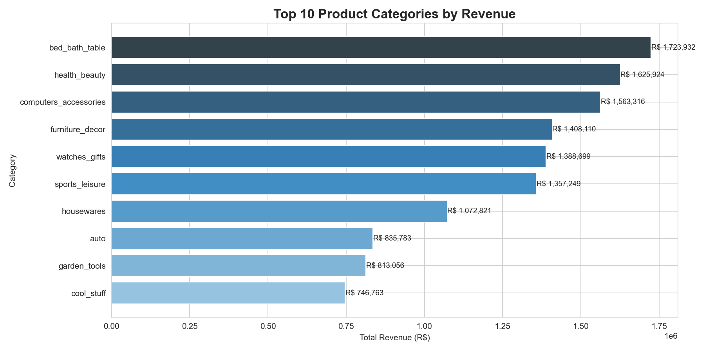
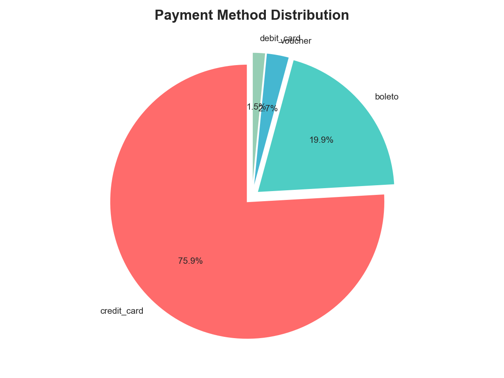
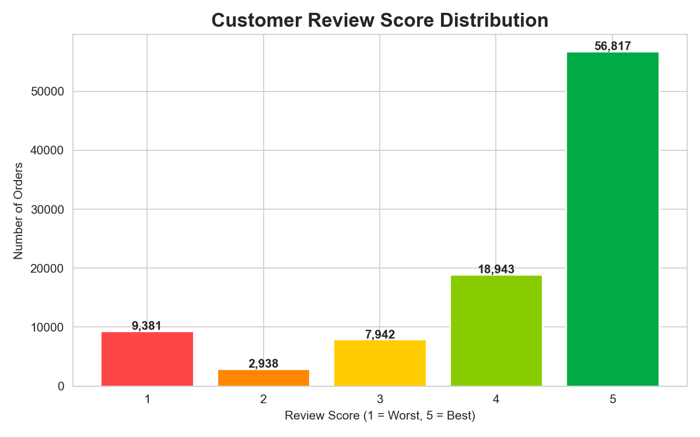
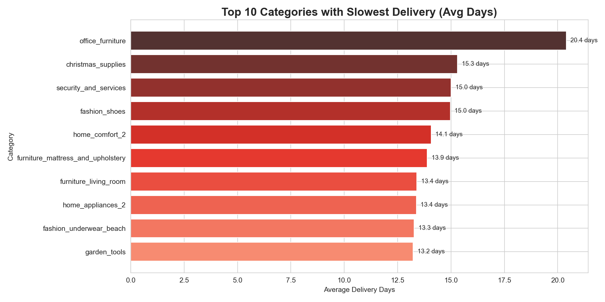
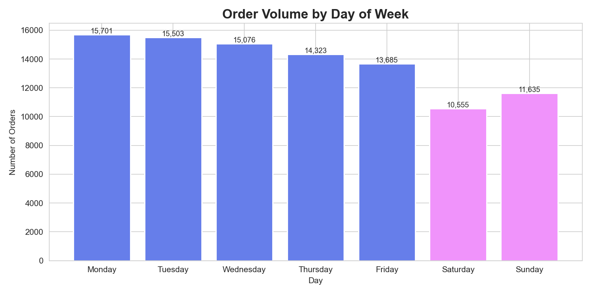
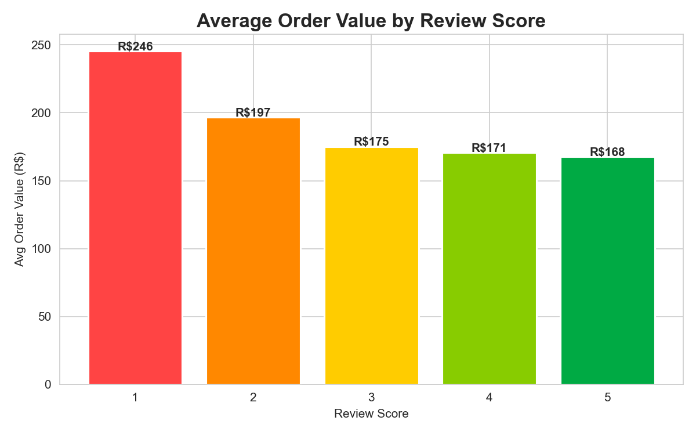

# 🛒 Brazilian E-Commerce Customer Behaviour Analysis


> **An end-to-end data analysis project on 100,000+ real e-commerce orders from Olist (Brazil's largest online marketplace), uncovering customer behaviour, revenue trends, delivery performance, and actionable business recommendations.**

---

## 📌 Business Problem

Olist is Brazil's largest e-commerce platform connecting small businesses to customers. The business team needs answers to:

- Which product categories drive the most revenue?
- What is the average customer satisfaction score — and what affects it?
- How long does delivery take — and which categories are slowest?
- Which days and months have the highest order volumes?
- What payment methods do customers prefer?

This project answers all these questions using Python EDA and an interactive Power BI dashboard.

---

## 🎯 Key Business Insights

| # | Insight | Business Recommendation |
|---|---------|------------------------|
| 1 | **Health & Beauty** is the #1 revenue category | Increase inventory & ad spend here |
| 2 | **73%** of customers pay via credit card | Introduce EMI offers to increase avg order value |
| 3 | Average delivery time is **12.5 days** | Reducing to under 7 days could boost review scores |
| 4 | **Monday** has the highest order volume | Run weekend flash sales to boost Saturday/Sunday numbers |
| 5 | Low review scores strongly correlate with delayed delivery | Fast shipping = better ratings = more repeat customers |
| 6 | Revenue grew **3x from 2017 to 2018** | Business is in strong growth phase — invest in scaling |

---

## 📊 Dashboard Preview

### Executive Summary


### Customer & Delivery Analysis


### Key Insights


---

## 📈 Python Analysis Charts

### Monthly Order Trend


### Top 10 Product Categories by Revenue


### Payment Method Distribution


### Customer Review Score Distribution


### Slowest Delivery Categories


### Orders by Day of Week


### Average Order Value by Review Score


---

## 📁 Project Structure

```
Ecommerce-Analysis/
│
├── data/
│   ├── master_clean.csv                        ← Cleaned merged dataset
│   ├── olist_orders_dataset.csv
│   ├── olist_customers_dataset.csv
│   ├── olist_order_items_dataset.csv
│   ├── olist_products_dataset.csv
│   ├── olist_sellers_dataset.csv
│   ├── olist_order_payments_dataset.csv
│   ├── olist_order_reviews_dataset.csv
│   └── product_category_name_translation.csv
│
├── images/
│   ├── 1_monthly_orders.png
│   ├── 2_top_categories.png
│   ├── 3_payment_methods.png
│   ├── 4_review_scores.png
│   ├── 5_delivery_time.png
│   ├── 6_orders_by_day.png
│   ├── 7_revenue_vs_review.png
│   ├── dashboard_page1.png
│   ├── dashboard_page2.png
│   └── dashboard_page3.png
│
├── notebook/
│   └── ecommerce_analysis.ipynb                ← Main analysis notebook
│
├── dashboard/
│   └── Ecommerce_Dashboard.pbix                ← Power BI dashboard
│
└── README.md
```

---

## 🔍 Project Workflow

```
Raw Data (8 CSVs)
      ↓
Data Cleaning & Merging (Pandas)
      ↓
Exploratory Data Analysis (Python)
      ↓
Business Insights (7 Charts)
      ↓
Interactive Dashboard (Power BI)
      ↓
Actionable Recommendations
```

---

## 📂 Dataset

- **Source:** [Kaggle — Brazilian E-Commerce Public Dataset by Olist](https://www.kaggle.com/datasets/olistbr/brazilian-ecommerce)
- **Period:** 2016 – 2018
- **Size:** 100,000+ orders across 8 relational tables
- **Features:** Orders, customers, products, payments, reviews, sellers, geolocation

---

## 🛠️ Tech Stack

| Tool | Purpose |
|------|---------|
| Python 3.x | Core programming |
| Pandas | Data cleaning, merging, grouping |
| NumPy | Numerical operations |
| Matplotlib | Charts and visualisations |
| Seaborn | Enhanced visualisations |
| Power BI | Interactive dashboard |
| Jupyter Notebook | Analysis environment |

---

## ▶️ How to Run

```bash
# 1. Clone the repository
git clone https://github.com/guptavanshi/Ecommerce-Customer-Analysis.git

# 2. Install dependencies
pip install pandas numpy matplotlib seaborn

# 3. Download dataset from Kaggle and place CSVs in data/ folder

# 4. Open the notebook
jupyter notebook notebook/ecommerce_analysis.ipynb

# 5. Open dashboard
# Open dashboard/Ecommerce_Dashboard.pbix in Power BI Desktop
```

---

## 🔮 Future Scope

- [ ] Customer segmentation using **RFM Analysis** (Recency, Frequency, Monetary)
- [ ] Build a **churn prediction model** using scikit-learn
- [ ] **Geospatial analysis** — which Brazilian states have highest order volumes
- [ ] **Sentiment analysis** on customer review comments using NLP
- [ ] Deploy an interactive web app using **Streamlit**

---

## 👩‍💻 About Me

**Vanshika Gupta** — Final year B.Tech student passionate about Data Analytics & Business Intelligence.

Skills: Python · Pandas · SQL · Power BI · Matplotlib · Seaborn · Excel

📧 Connect with me on [LinkedIn](https://linkedin.com/in/) | [GitHub](https://github.com/guptavanshi)

---

> ⭐ If you found this project useful, consider giving it a star!
